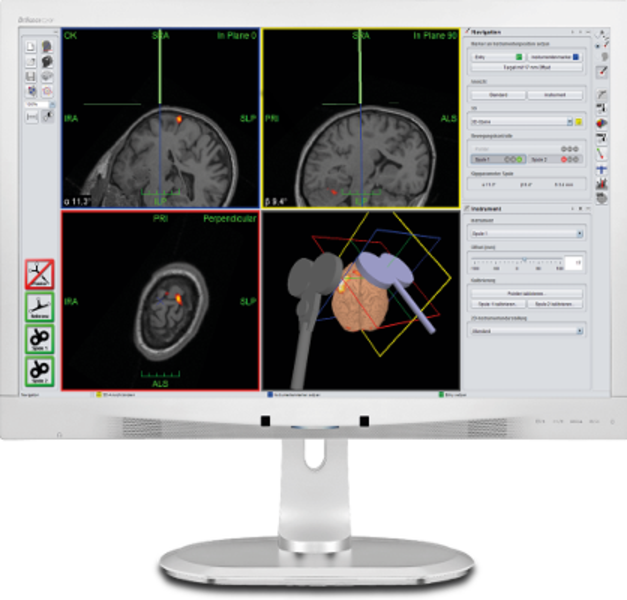
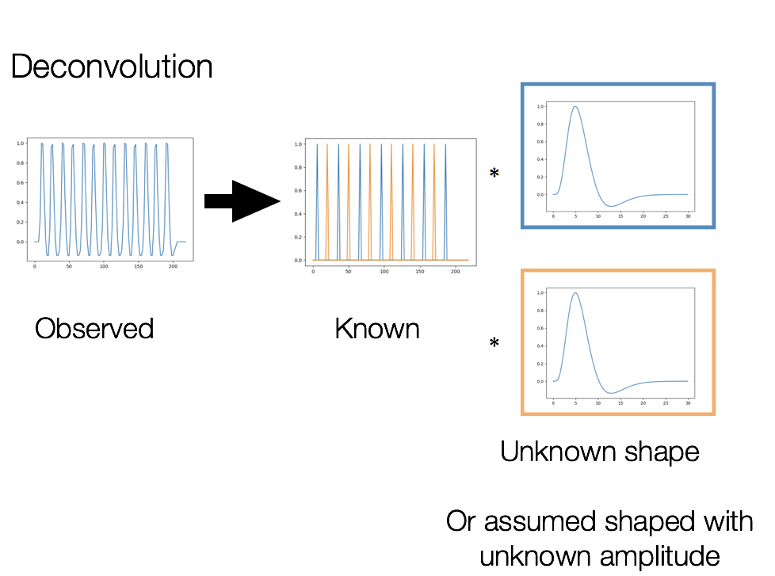

footer: MR Methods for Faculty I, 9/8/17
slidenumbers: true

#MR Methods for Faculty I
## Roeland Hancock
### Associate Director, BIRC
### 8 September 2017

----

#Introduction

##My role at BIRC
- IBRAiN training
- Consult on study design and execution

---
#Introduction
## My research interests
- Individual differences in the neurobiology of language
- Auditory processing, reading, and syntax
- Using magnetic resonance spectroscopy (MRS) for individualized models of dynamics
- Reliable single subject phenotypes (e.g. functional localizers)

----

#Course Overview
- _Conceptual_ overview of designing and executing a neuroimaging (MRI) study
- Not intended as an applied introduction 
- Today:
 - General principles
 - BIRC
 - fMRI

**Next session 9/22**

---

#Siemens 3T Prisma
- 20 & 64 channel head/neck coils
- Peripheral coils
- In-scanner Avotec audio
- LCD display
- In-scanner eye tracking


---
#MR Modalities
- Anatomical (T1, T2, PD)
- Functional MRI (fMRI)
- Diffusion MRI (DWI)
- Magnetic resonance spectroscopy (MRS)
- Simultaneous multislice (SMS/multiband) fast fMRI and DWI

---

#Mock Scanner
- Valuable for pediatric and clinical samples
- Replicates some aspects of the MRI experience
- Confinement
- Head coil/mirror
- MR sounds
- Button responses


----
#Dense EEG

- 256-channel EGI EEG systems
- MR-compatible EEG for simultaneous fMRI/EEG
- Out of scanner EEG
- Sound booth
- Response pads
- Etymotic insert audio
- Improved spherical coverage


---

#Electrode Positioning

- EGI Geodesic Photogammetry System (GPS)
- Record subject-specific electrode locations on the scalp
- For source models or tDCS targets


---

#High density tDCS/tACS/tRNS
- Modulates neural excitability
- Addon to the EGI EEG system
- Theoretically improved current localization over traditional tDCS


---
#Transcranial Magnetic Stimulation
- Modulates neural excitability/triggers action potentials
- Virtual lesions
- MagVentures MagPro X100 + MagOption
- High duty monophasic and biphasic pulse trains
- rTMS and paired pulse
- Liquid cooled blinded active/sham coil + others


---
#Navigated TMS

- Localite TMS Navigator System
- Localize TMS pulses to individual or template anatomy



---


#Getting Help at the BIRC
- Wiki: [http://birc-int.psy.uconn.edu/wiki](http://birc-int.psy.uconn.edu/wiki)
 - Manuals
 - Howto guides
- [http://birc.uconn.edu](http://birc.uconn.edu)
 - Equipment information
 - Seed grants
- BIRC_HELP-L@listserv.uconn.edu
- [Roeland.Hancock@uconn.edu](mailto:Roeland.Hancock@uconn.edu)

----

#Getting Organized: The Problem
You may have files with names like

_R01 110715\_formatted\_xx\_major\_FINAL copy\_yy.doc_

Or directories with files like

```
localizer_exp_xx.py
localizer_exp_v3.py
localizer_exp.py
```

**What are these files??**

*Names have been redacted.

---

#Getting Organized: The Problem
>Prof. Smith had a brilliant idea – without acquiring any new data he will be able to test his new hypothesis. All he has to do is to get his PhD student to reanalyze the data acquired by his postdoc two years ago. Brilliant! And so cheap!

From the Stanford Center for Reproducible Neuroscience
[reproducibility.stanford.edu](http://reproducibility.stanford.edu)

---

#Getting Organized: The Problem

>Everything was rosy until he tried to put his plan into practice. First of all he thought he had all the data – sitting on an external hard drive the postdoc gave him the day before he left. What prof. Smith found on the device was a messy collection of binary files, spreadsheets with column names that only experts from Bletchley Park could decipher and folders called “copy\_v2\_do\_not\_touch”. The postdoc was of course unreachable – digging wells in Malawi. It will take weeks to make sense of this data, before the student will be able to start working on the project…

---

#There is a Better Way 

---

#Complexities of Neuroimaging

- Lots of data
- Very expensive
- Rich datasets with high archival/secondary analysis value
- Relatively standard steps for preprocessing data

Data storage needs to be systematic, documented, and suitable for archiving.

----

#Complexities of Neuroimaging

- Complex multistep analyses
- Analyses often need to be repeated

Analyses need to be programmed to reduce errors, improve efficiency, reuse, and reproducibility.

----


#Benefits

**Your life will be easier**

- Research becomes more efficient
 - Easy to establish workflows
 - Reduced loss of knowledge/learning curve when people leave/arrive
 - Prepared to meet data sharing requirements for publication
 - Easier collaboration

----

#Benefits

**Better science**

- Data sharing
- Others can reproduce your work
- Others can easily confirm the validity of your analyses or spot problems

----


#General Principles

- Write code
- Use a consistent naming convention amendable to variable substitution
- Keep data easily machine readable (esp. spreadsheets)
- Use text-based documents and data (e.g. CSV instead of SPSS) when possible

---

#General Principles

- Write clean, documented code for analyses
- Use version control instead of file copies 
- Integrate code and prose
- Enforce process in your lab

---

#Exercise

Think about how you organize files for your current and past projects.

- How long would it take a new lab member to understand the organization and find the files they need?
- Do you remember which files are important for a project you finished two years ago?
- Can you easily identify which data were used in publication and the analysis history?
- How could the organization be more transparent?


---


#File Organization
Have a consistent organization for your projects

###Minimal file tree:

- Scripts
- Data
 - Keep raw and derivative data separate
- Results/reports/manuscripts

---

#BIDS
_Brain Imaging Data Structure_ (Gorgolewski et al., 2016; [bids.neuroimaging.io](http://http://bids.neuroimaging.io))


---
#BIDS Benefits
- Used by data repositories
- Works with many programs and processing pipelines
 - [bids-apps.neuroimaging.io](http://bids-apps.neuroimaging.io)
 - [bids.neuroimaging.io](http://bids.neuroimaging.io)
- Documents key information in easily parsed filenames
- Extensions for [derivative data](https://docs.google.com/document/d/1bq5eNDHTb6Nkx3WUiOBgKvLNnaa5OMcGtD0AZ9yms2M/edit#heading=h.mqkmyp254xh6) and [statistics](https://docs.google.com/document/d/1Wwc4A6Mow4ZPPszDIWfCUCRNstn7d_zzaWPcfcHmgI4/edit)

---

#BIDS File Hierarchy
- Study
 - Subject (sub-NN)
     - Session (optional) 
         - Modality (anat, func, dwi)
             - Data files

----
#BIDS Directory Names

Anatomical data: `sub-<participant_label>/[ses-<session_label>/]anat`

_sub-01/ses-time1/anat_


----

#BIDS Directory Names

fMRI data: `sub-<participant_label>/[ses-<session_label>/]func`

_sub-01/ses-time1/func_

----


#BIDS File Names

In `anat`: `sub-<participant_label>[_ses-<session_label>][_run-<index>]_<modality_label>.nii[.gz]`

_sub-01\_ses-time1\_run-01\_T1w.nii.gz_

_sub-01\_ses-time1\_run-01\_T2w.nii.gz_


----

#BIDS File Names


In `func`: `sub-<participant_label>[_ses-<session_label>]_task-<task_label>[_acq-<label>][_run-<index>]_bold.nii[.gz]`

_sub-01\_task-language\_run-01\_bold.nii.gz_

_sub-01\_task-rest\_acq-multiband\_run-02\_bold.nii.gz_


----

#BIDS Resources

- Spec: [bids.neuroimaging.io](http://bids.neuroimaging.io)
- Applications: [bids-apps.neuroimaging.io](http://bids-apps.neuroimaging.io)
- DICOM to BIDS: [github.com/jmtyszka/bidskit](https://github.com/jmtyszka/bidskit)
- DICOM to BIDS: [github.com/nipy/heudiconv](https://github.com/nipy/heudiconv)
- BIDS to Python: [github.com/INCF/pybids](https://github.com/INCF/pybids)

----


#Version Control
- Track the history of a file
 - What changed
 - Who changed it
- Track and integrate parallel versions
- Revert to a prior version


---
#Version Control Benefits
- Recover a prior version of an analysis
- Tag the current state of the repository (my-science-paper)
- Collaborate
- Non-disruptively experiment and integrate after testing
- Review and selectively approve contributions

---
#Version Control Systems
- [github.com](http://github.com)
 - Very popular
 - Private free for edu
 - Nice web interface + simple web hosting
- [bitbucket.org](http:/bitbucket.com)
 - Mercurial; simpler than git
 - Private free for everyone

#Version Control Systems

**Both**

- Free public repositories
- Wiki
- Issue tracking
- Cross-platform

---

#Not Just for Code

- Version control best for text files
- Can also manage binary data files ([git-lfs.github.com](http://git-lfs.github.com))
- Formatted manuscripts can be written using plain text markup or typesetting languages

---

#Markup and Typesetting

Markup and typesetting languages separate content and appearance.

- Special formatting strings are added to plain text
- Files are then rendered as PDF, DOC or other formats
- Easy integration with version control
- Integration of code and explanatory text (R Markdown)

----


```markdown
#Markup and Typesetting
**Markdown (.md)**

- Simple formatting commands
- Easily readable
- Integrates well with code (e.g. Rmarkdown)
- This presentation is written in Markdown and displayed with Deckset
```

---


#LaTex

- Sophisticated typesetting langauge
- Equations
- Reference and citation formatting
- Figure numbering and captioning
- Easy to change style (e.g. a different journal)
- Plays well with R (`knitr`, `sweave`) 

----

# Easy Collaborative Writing 
- Google Docs [docs.google.com](http://docs.google.com)
 - + F1000 for references [F1000.com](http://f1000.com)
- [sharelatex.com](http://sharelatex.com), online Google Docs like LaTeX editing
- Markdown + [GitHub.com](http://github.com)

----

# Version Control for Software

- Results can be dependent on specific software configurations
- Software version changes can break your code and prevent replication
- You may need conflicting software for different analyses

----

# Containers

- Package specific system configurations
- and document how the system was created
- Provide a reproducible environment for your analyses
- Ease setup of new computing environments
- Usable in environments where you cannot install your own software

----

# Container Systems

**Docker** [docker.com](http://docker.com)

**Singularity** [singularity.lbl.gov](http://singularity.lbl.gov)

- (Storrs) HPC compatible
- Loads Docker layers
- (possibly) coming soon(ish) to BIRC

----
# Existing Containers

Several neuroimaging workflows are available as containers.

**Singularity:** [singularity-hub.org](https://singularity-hub.org) 

**Docker/Singularity:** [hub.docker.com](http://hub.docker.com)


---

#Planning an MRI Experiment

- **Logistics**
- Design
- Analysis

----

#Logistics
**MR Safety:**

- [birc.uconn.edu/safety-training-training-opportunities](http://birc.uconn.edu/safety-training-training-opportunities/)
- Training required for all users
- MR RTs (Elisa and Morgan) run the actual scan
- Researchers need to be present to meet participants, run tasks, etc

**Other training:** [Roeland.Hancock@uconn.edu](mailto:Roeland.Hancock@uconn.edu)

----

#Logistics

**IRB**

- Use the template IRB-1 forms on the BIRC wiki
- Make it clear that you are using approved template language
- Reference other relevant approvals
- Email me if the IRB objects to **approved** BIRC language

----
#Logistics

**Funding**

- KFS #
- $500/hr (MR)
- Billable in 15 minute increments
- Seed grants are available to support pilot MR data collection for those seeking external funding
- NIH-style resources page on the wiki

----

#Logistics

**Scan Protocol**

- Send Elisa and/or me the desired scan sequence, specifying as many parameters as possible
- We will make sure the desired sequences are available and setup the sequence at the console
- Contact me if you have questions about planning your protocol or parameter choices


----

#Logistics

**Protocol Development Time**

Unbilled magnet time to ensure that:

- Data are of sufficient quality
- BIRC meets the technical needs of the project
- Tasks, which you have already tested outside the scanner, work in the scanner

Not time to see if your experiment produces the desired effect.


----

#Planning an MRI Experiment

- Logistics
- **Design**
- Analysis

----

#fMRI Experimental Design
_How to get the best big, beautiful, blobs_

- What is the (null) hypothesis?
- What are the conditions to be compared?
- What is the optimal way to order/time the conditions?


---

#Key Concepts
- Absolute magnitude of the BOLD signal is not meaningful
- The hemodynamic response function (HRF) is a filter
- Efficiency is defined for contrasts, not design matrices
- No free lunch theorem

---

#Basic types of designs
- Subtraction
- Factorial
- Conjunction
- Parametric

---

#Subtraction

- To isolate the effect of interest, _A_, compare _(A+B)-B_
- Assumes that _A_ and _B_ add and have linear effects (‘pure insertion’
- Simplest form: _B_ is a resting baseline


----

#Subtraction
Better: use a low-level perceptual baseline


---

#Subtraction
Consider whether your subtraction adequately isolates your process of interest.


---

#Subtraction
- Subtraction assumes unitary cognitive processes that can be added
- Requires that you have a theory about how processes separate
- Make minimal pairs along a single dimension
- e.g. change task or change (type of) stimuli (on one dimension), but not both

----

#Detection vs Estimation

**Detection Efficiency**
Given the shape of the hemodynamic response, can I detect a difference in the amplitude of the response between conditions?

**Estimation Efficiency**
What is the shape of the hemodynamic response?

---

#Detection

- Assume words and pseudowords differ only in the amplitude of this function
- Is the amplitude larger for words?


----

#Estimation

- Does the amplitude peak sooner for words than pseudowords?
 - For this, we have to estimate the response function for each condition
 - AND detect differences at each time point


---


---
#What determines efficiency?

- t-test
- Maximize the difference in beta estimates
	- Maximize the experimental signal of the contrast
- Minimize the variance
	- Maximize the ability to estimate the response function


----



---


----

#Increasing Efficiency

- Minimize correlation between convolved events
- Keep contrast frequency within the ideal bandpass


----

#Types of Designs

- Block
- Slow event related
- Fast event related
- Mixed (event related within a block)


----

#Block Designs

- Long (10-30s) condition blocks
- Optimal detection efficiency
- Zero estimation efficiency

---

#Should I Use a Block Design?
No if

- Estimation is at all important
- Psychologically undesirable
- Many conditions compared far apart in time

Maybe if

- You need to model accuracy or RT (mixed design)

----

#Rapid Event Related Designs

- Event responses overlap
- Variable (jittered) intervals between events
- Variable sequence of event types (conditions)
- May be constrained by desired psychological properties of the event sequence

**Challenge:** What is the best way of spacing and ordering events?

---

#Stochastic Optimization 
1. Fix scan length, TR and number of stimuli
2. Generate a pseudorandom sequence of events (possibly subject to constraints)
3. Construct the convolved design matrix
4. Add noise and filter
5. Calculate efficiency
6. Repeat many times and select the best sequence

----

#Evaluating Designs

- Conceptually, more efficient designs have lower variance in the estimators
- Efficient statistically
  - A higher efficiency design has high precision/better parameter estimates/smaller confidence intervals
- Efficient in time
 - A higher efficiency design needs fewer trials to reach a given level of precision in the estimates

---

#Efficiency

- There are variations on how efficiency is calculated, but all are related to the variance associated with (X’X)<sup>-1</sup>
- AFNI: sqrt(c’ (X’X)<sup>-1</sup> c) (lower better)
- Efficiency (optseq): 1/tr(c’ (X’X)<sup>-1</sup> c) (higher better)
- Unnormed: c’ (X’X)<sup>-1</sup> c (lower better)

where _X_ is the design matrix and _c_ is the contrast (for detection efficiency)

----

#Better Optimization

The space of random designs is extremely large!

Alternatives to brute search:

- 'Breed' optimal designs using a genetic algorithm (Wager & Nicols, 2003) 
- Start with an analytically good design

---

#m-sequences

A good design has low autocorrelation

**Random**


**m-sequence**

---

#m-sequences

- Autocorrelation is an impulse response + DC term
- Have high entropy
- Balanced: for p classes of stimuli
 - Classes 2-p can occur n times
 - Class 1 occurs n-1 times (usually treated as a null event)
- Counterbalanced: for a k bit sequence, every k-tuple appears
 - e.g. all permutations of (A,B,C) would occur in a 3 class design

---

#m-sequences

- Require a prime number (p) of stimulus classes
- For p stimulus classes, the length of the sequence is pk-1
- Not appropriate if trial order must be conditional
- But can be creatively edited to preserve useful properties

---

#Optimization Software

- `RSFgen` (AFNI)
- `make_random_timing.py` (AFNI)
- `optseq2` (MGH/FreeSurfer)
- Genetic algorithms [psych.colorado.edu/~tor/Software.htm](http://psych.colorado.edu/~tor/Software.htm)
- m-sequences [cfn.upenn.edu/aguirre/wiki/public:m_sequences](https://cfn.upenn.edu/aguirre/wiki/public:m_sequences)


----

#Resources

- [imaging.mrc-cbu.cam.ac.uk/imaging/DesignEfficiency](http://imaging.mrc-cbu.cam.ac.uk/imaging/DesignEfficiency)
- BIRC wiki


---

