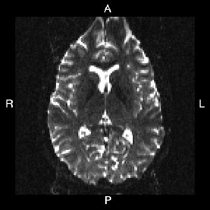
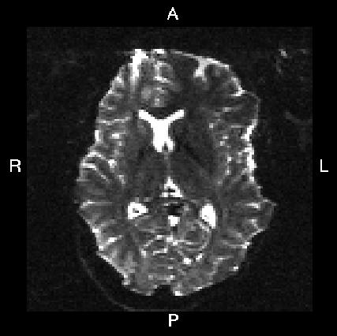

footer: MR Methods for Faculty II, 10/6/17
slidenumbers: true

#MR Methods for Faculty II
## Roeland Hancock
#### Associate Director, BIRC
#### Assistant Research Professor, Psychological Sciences

#### 6 October 2017

----

#Internal Reproducibility

*You should be able to effortlessly reproduce your own analysis*

- Version Control
- Data provenance
- Automated, reproducible computations
- Documentation
- Replicable computational environments

---

#Review

*Internally reproducible research*

- Organize your data ([BIDS](http://bids.neuroimaging.io))
- Use scripts
- Use version control ([git](http://github.org))
- Options for making reproducible software environments ([singularity](http://singularity.lbl.gov)]

---

#Review

*fMRI task design*

- Block vs event designs
- Detection vs estimation efficiency
- Design optimization is important

---

#Review

*Resources for design optimization*

- `RSFgen` (AFNI)
- `make_random_timing.py` (AFNI)
- `optseq2` (MGH/FreeSurfer)
- Genetic algorithms [psych.colorado.edu/~tor/Software.htm](http://psych.colorado.edu/~tor/Software.htm)
- m-sequences [cfn.upenn.edu/aguirre/wiki/public:m_sequences](https://cfn.upenn.edu/aguirre/wiki/public:m_sequences)

---

---

#Group vs Individual Activation

- Group average data does not reflect individuals
- Group analyses may not be reliable if the underlying activation is highly variable

---

#Low Within Subject Reliability

 - Test-retest fMRI reliability is poorly characterized
  - 10s of thousands of publised task fMRI studies
  - 63 with test-retest measures (Bennet et al., 2010)
- Low test-retest reliability (mean ICC = .5; mean overlap = 29%)

---

#Limitations of Reliability

Poor reliability limits scientific value

- Between group analyses
- Brain-behavior correlations
- Neurogenetics
- Functional localizers
- Databasing

---

#Improving Reliability

- Increase SNR
- Optimize design power
- Minimize confounds (time of day, attention, practice)
- But fMRI is fundamentally noisy
- Select tasks with high reliability and/or do test-retest on your own data

---

----

#Today

- Data acquisition
- Preprocessing for volumetric analysis
- Single subject statistics (mass univariate)

---

#Implementing Your Task

- Use your preferred stimulus presentation software
- Check that timing is relatively consistent
- Target output: event or block onset times, temporally aligned with BOLD data
- Use the scanner TTL pulse to align your fMRI data

----

#fMRI Scan Sequence

_Nominal setup at BIRC; other sequences are possible_

1. Researcher preps the experiment on stimulus PC
2. Operator starts the BOLD sequence
3. Dummy volume collection
4. Scanner sends a trigger pulse
5. Experiment starts

---

#Scanner Pulses
- The scanner sends a `5` keystroke at the beginning of each volume that is kept
- Wait for a `5` response to start the experiment
- Offset event times based on the initial `5` response
- More sophisticated timing setups are possible

----

#Testing your Experiment

Before scanning, check that

- Your event timing is consistent between runs
- You understand the timing variables
- You understand how to align your events with fMRI data

---

#BOLD Display

See the [MRI Display](http://birc-int.psy.uconn.edu/wiki/index.php/MRI_Display) article on the BIRC wiki for visual angle calculations

---

#MRI Protocol
- Develop a general idea of the scan parameters you want
 - Consider existing literature
 - Major projects: ADNI, HCP
- Special considerations:
  - Specialized analysis methods
  - Unusually high temporal or spatial resolution
  - Challenging brain regions 
 
---

#Parameters
**Spatial resolution:**

- 2-3 mm3 for typical fMRI and DWI
- Spatial resolution vs SNR (2mm3 is a ~70% reduction in SNR from 3mm3)
- Spatial resolution vs acquisition time
- How big is your primary structure of interest?
- Do you have a high movement population?

---

#Parameters
**Temporal resolution:**

- Typically one sample every few seconds
- Faster is better...
 - Less motion between samples
 - Less physiological aliasing
 - More degrees of freedom
- ... to a degree

----

#Parameters
**Temporal resolution:**

Definitely choose the fastest unaccelerated sampling possible. 

If you need more speed:

- Partial imaging (iPAT/GRAPPA/ASSET/SENSE)
 - Fills in part of the MR signal 
 - SNR cost (√2 or more)
 - Increased motion sensitivity

----

#Parameters
**Temporal resolution:**

- Simultaneous multislice (SMS/multiband)
 - Minimal SNR cost
 - Some increased motion sensitivity in some cases
 - <1s sampling possible
 - Also works for DWI

----

#Parameters

**Other considerations:**

- Do you need whole brain coverage (partial coverage is faster)?
- Are you interested in regions prone to signal loss (vOFC, amygdala, temporal regions)?

--- 

#Hardware Options

BIRC has a 20-channel head coil and 64-channel head/neck coil

64-channel:

- Better SNR, especially at the surface
- Necessary for SMS or high acceleration
- Smaller
- More heterogeneity

---

#Flip Angle

- Flip angle partially determines how much signal you get
- Maximum signal at 90º for an unexcited sample
- For partially excited samples, maximum at the Ernst angle
- Maximum tSNR in BOLD at lower flip angles

---

#TE

- Optimal signal when TE matches tissues T2*
- Optimal TE varies across the brain, ~20-40ms
- Regions with signal loss (temporal, vOFC) have shorter T2* (<30ms)
- Regions with good signal (occipital cortex) have longer T2* (~40ms)
- Slices take longer to acquire with longer TE

---

#Bias Correction

- Receive coil channels have different spatial sensitivities
- Can be corrected online (Prescan Normalization)
- Or offline
- Some sequences save corrected and uncorrected data

---

#Selecting Parameters

- There is no set of universally best parameters
- Consider
 - Your brain regions of interest
 - The expected level of subject movement
 - Your hypotheses and analysis needs
- Pilot and use tSNR as a guide

 ---

#Scans (for fMRI)

**Must have**

- Scout for positioning scans (~30s)
- T1-weighted (~5-7 min)
 - Standard structural volume for normalization
- Some type of field map (~10-120s)
 - Correct for EPI distortion
- fMRI 

---

#Time Management

- Prep and setup: ~10 min
- Scout, T1, fieldmap: ~6-8 min
- Cleanup: ~5 min
- Checkin/instructions/setup between scans: ~1 min
- ~35-40 minutes for fMRI in a 1 hour booking

---

#After the Scan

- Data appears in [NiDB](http://psypacs.psy.uconn.edu/nidb/index.php)
- Download DICOM data
- Convert to BIDS
- Preprocessing and analysis

---

#fMRI Processing and Analysis
1. Quality control
2. Minimal preprocessing 
3. Quality control
4. Subject level statistics
5. Group level statistics

----

#Quality Control 1
 

 Make sure you have the expected data:
 
 - Files for each expected MRI series
 - Behavioral log files
 - Do data volumes have the correct dimensions?
 - Were the correct scan parameters used?
 - [BIDS-validator] (https://github.com/INCF/bids-validator) can help

----

#Quality Control 2

Check fMRI data for

- Ghosts (signal outside the brain)
- tSNR
- Large initial intensity
- Use [QAP](http://preprocessed-connectomes-project.org/quality-assessment-protocol/) or [mriqc](http://mriqc.readthedocs.io)
 - BIDS compatible!

----

#Minimal preprocessing (fMRI)
- Slice time correction
- Motion correction
- Distortion correction
- Co-registration

---

----

----

#Slice Time Correction

- Interpolate the time series from each voxel to effectively align the data to a common time point
- Alternative solutions
 - Ignore (for short TRs)
 - Model derivatives of the HRF 

---

#Processing Order

There are different approaches to slice time correction:

- Not at all
- Before motion correction
 - Head movements can shift voxels in and out of the head-bad for interpolation
- After motion correction
 - Motion correction can shift voxels into adjacent slices at different timepoints-particularly bad for interleaved acquisition

---

#Recommended Processing Order

- Needed for effective connectivity
- Always helps detection (Sladky et al, 2011)
 - but maybe not much if TR is short

1. Denoise the data (spikes spread during interpolation)
2. Correct for timing _before_ motion correction if slices are interleaved

----

#Slice Order
**When were the slices acquired?**

Varies by sequence and manufacturer:

- ascending or descending
- sequential or interleaved 
- starting from first or second slice

Or something more complicated, e.g. SMS

----

#Determining Slice Order

- Check the raw data (e.g. DICOM images)
 - Always start with the raw data if you are unsure of scan parameters or don't trust processed headers
- Inspect NIfTI headers (fslhd, nifti_tool) or .HEAD (3dinfo)
- Usually `alt+z2` (even # of slices) or `alt+z` (odd) here

---

# Physics of Motion

Motion **irreparably** affects your data
 
- Motion rotates the brain though regions of variable B0 inhomogeneity
 - Can alter correlations between brain regions
 - Introduce regions of signal loss
- Moves regions of the brain between excitations
 - Introduces regions of changing signal intensity

----

#Motion Artifact

----

#Minimize motion

- Train subjects in a mock scanner
- Use padding or restraints
- Emphasize importance of staying still
- Monitor compliance

----

#Realignment

**Goal:** put voxels in the same place throught the scan

- Spatially correct for movements from volume to volume in an EPI time series
- 6 degrees of freedom (DOF)
 - rotation (roll, pitch, yaw)
 - translation (x, y, z) shifts
- Interpolate voxels to a fixed grid

----

----

#Choices
- Another b0 volume that will be used with anatomical alignment
 - For example the reference image from a multi band time series
- First volume-maybe higher signal
- Third volume-maybe a better match to the rest of the time series
- Middle volume-minimize interpolation distance
- Min outlier volume-a volume with minimal artifacts

---

#EPI distortion

- Field inhomogeneity distorts EPI along the phase encode axis
- Particularly problematic for DWI
- Ideally correct for this using a fieldmap and/or nonlinear alignment

---

### A/P 

---

### L/R 

--- 

#Approaches

- Collect a 'real' fieldmap
- Collect multiple scans with flipped PE direction
- Nonlinear warping

---

#Distortion correction

1. Calculate a field map
2. Align the fieldmap and EPI
3. Unwarp the EPI distortion
4. Best done with motion correction

FSL tools: `fugue` and `topup`

---

#Co-registration

**Goal:** Align the fMRI data to another dataset

- Typically a T1-weighted anatomical volume
- The T1 (and aligned fMRI) can then be aligned to a template

---

#Co-registration options

- Rigid body
 - Not ideal between modalities
- Affine transformation
 - Also adjusts shearing and scaling
 - Doesn't address geometric distortion
- Non-linear
 - Addresses distortion
 - Recently recommended (Friston et al., 2017)

----

#Preprocessing Pipelines

- AFNI and FSL do some or all steps
- [fmriprep](http://fmriprep.readthedocs.io/en/stable/)
 - Also generates images for review

---
 

#Quality Control

- Establish acceptable criteria before analysis
- Mix of visual inspection and quantitative mettics
- Visual
 - Inspect registration
- Quantitative
 - Motion
 - tSNR  

---

#Quality Control Tools

- [mriqc](http://mriqc.readthedocs.io)
- [QA](http://preprocessed-connectomes-project.org/quality-assessment-protocol/)

---

#Statistics

- Smoothing to increase SNR
- High pass filtering (.01-.02 Hz) to remove slow drifts
 - Filtering needs to be considered during design
- Scaling
- Single subject GLM  

---

#Motion Regressors

- Effort to account for motion-relate signals
- Realignment produces 6 (translation and rotation on 3 axes) motion parameters
- Motion effects extend over time
- Include derivatives or other expanded parameter sets

---

#Motion Metrics

- RMS: absolute volume displacement
- FD (framewise displacement): volume to volume displacement
- DVARS: volume to volume changes in intensity

---

#Censoring

- aka scrubbing
- Remove motion contaminated volumes from analysis
- Possibly some successive or prior volumes
	- Delete data (affects filtering and model)
	- Regressors
	- Interpolation (affects df) 

---

#Statistics

- BOLD response is modeled in a GLM
- Stimulus onsets * HRF or basis
- GLM includes motion regressors and other confounds

---

---

#Basis Functions

- 'Canonical HRF': a double gamma response
	- Assumes the HRF has a particular shape 
- FIR, tent, sine, spline
 - Estimates HRF

---

#Stimulus Functions

- Delta function
 - Each event is instantaneous
- Block function
 - Events extend in time
 - HRF reaches a set maximum after time

---

#Design Matrix

- Specify a basis and stimulus function for each condition
- Convolve the basis and stimulus functions
- Add motion and other non-task regressors

----

#Statistics

- GLM (OLS or REML)
- Linear constrasts between conditions
- and/or F tests
- Result: t/z/F values and beta values

---

#Multiple Comparisons

- Mass univariate statistics are over 10-100s of thousands of tests
- Statistics need to be corrected for number of comparisons
- Corrections should account for spatial structure

---

#Correction Options

- Familywise Error (FWE) 
- *False Discovery Rate (FDR)*
- Random field cluster-based correction
- Threshold based statistics (TBSS)
- *Permutation cluster-based correction*
- *Permutation*
  
---

